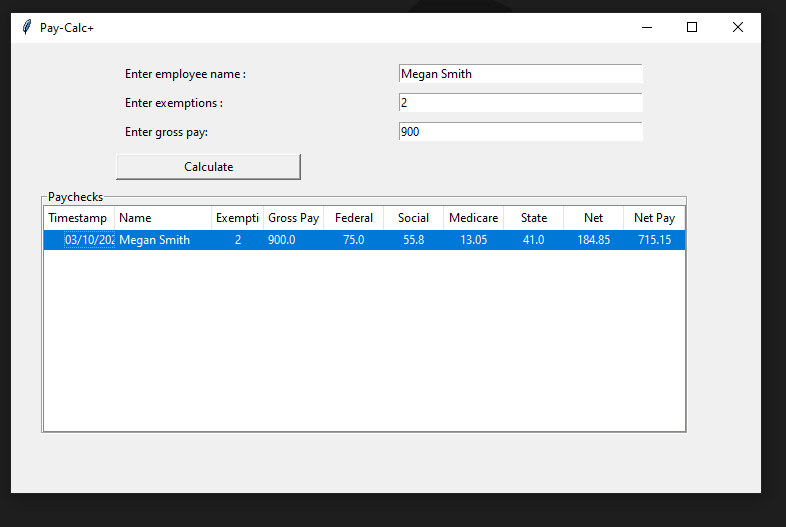

# PAY-CALC+

## Overview

This is a desktop GUI app made with python, and tkinter. It takes input from the user (employee name, gross pay, exemptions)
and calculates weekly paycheck deductions automatically.

State deductions are calculated using formulas from the [Virginia Income Tax Withholding Guide](https://www.tax.virginia.gov/sites/default/files/inline-files/Employer%20Withholding%20Instructions.pdf).

Federal deductions are calculated using percentage method tables for automated payroll systems. These are described in
in detail on page 8 of [Federal Income Tax Withholding Methods](https://www.irs.gov/pub/irs-pdf/p15t.pdf).

## Details

Limitations and issues:
- Formulas will need to be updated for 2022
- Assumes employees are paid on a weekly period
- Federal formula makes the following assumptions about employee:
  - W-4 is from 2019 or earlier
  - Or if W-4 is from 2020 or beyond, employee has not checked box in Step 2 of W-4 (multiple jobs)
  - Salary is in the range of $0 - $90,325

## Demo

